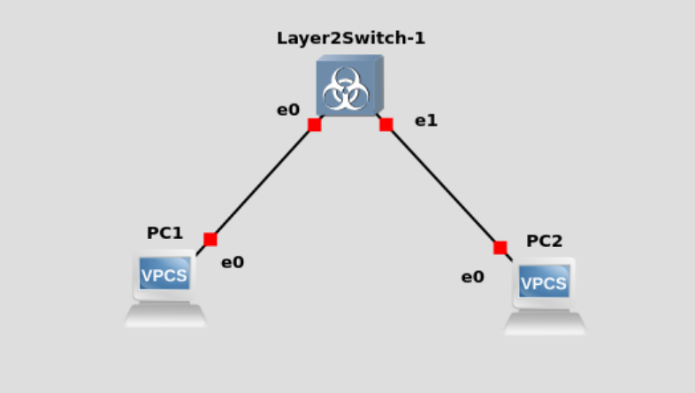
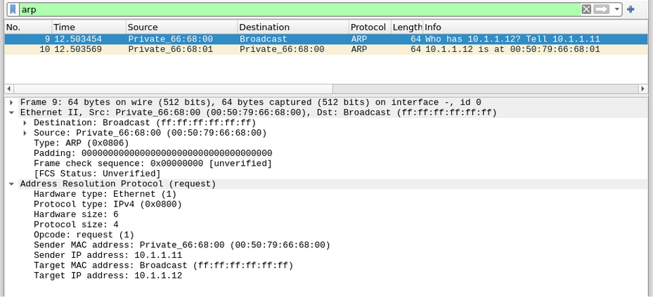
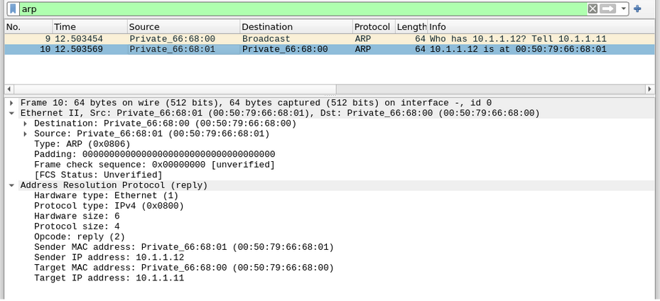
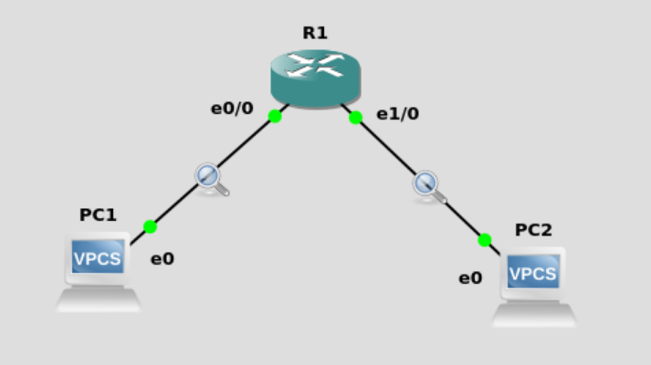
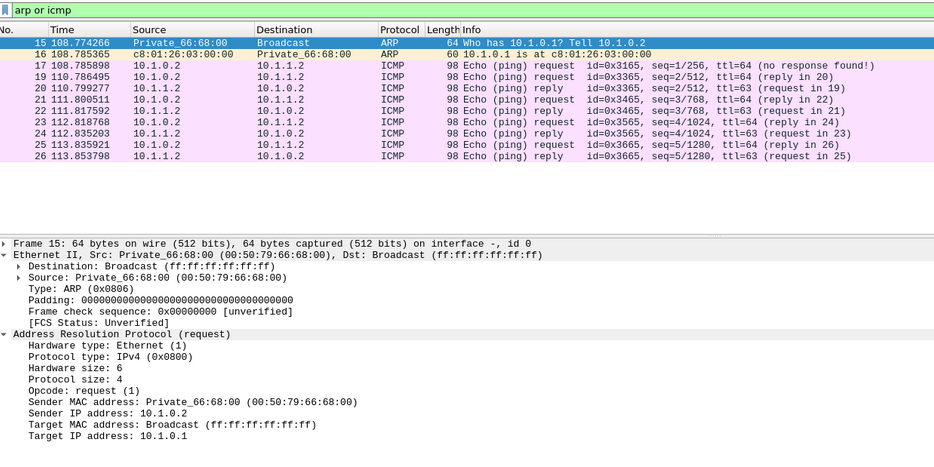
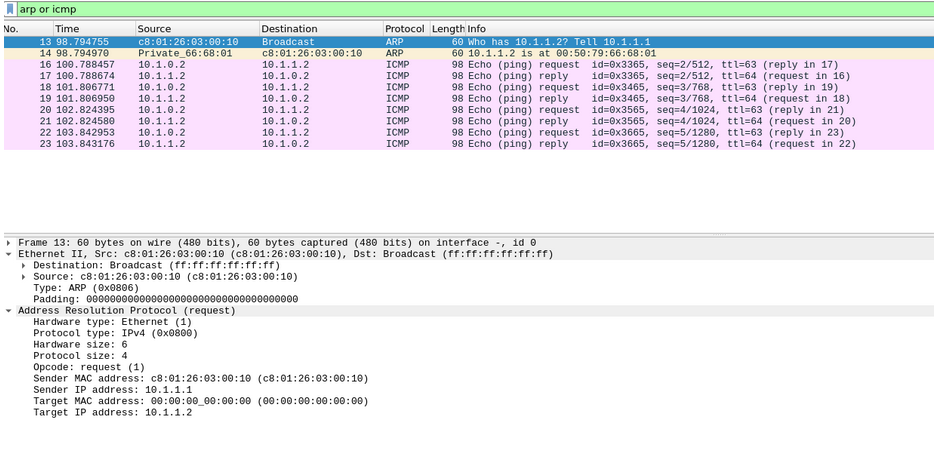

# Настройка протокола STP
# Часть 1

## Команды настройки

### pc 2
```shell
PC2> ip 10.1.1.12/24
```

### pc 1
```shell
PC1> ip 10.1.1.11/24
PC1> ping 10.1.1.12
```

## Анализ перехваченного трафика
1) Wireshark, после выполнения команды ping, перехватил на обоих линках два ARP пакета. 
2) Первый хост послал широковещательный ARP запрос со своим MAC адресом и IP адресом второго хоста.
3) Второй хост получил APR запрос, увидел в нем свой IP адрес и отправил ARP reply со своим MAC адресом первому хосту.

В итоге первый компьютер смог узнать MAC адрес второго компьютера по его IP адресу с помощью протокола ARP.

## Физическая топология сети



## Перехват трафика
### PC 1

### PC 2


# Часть 2
## Команды
### R1
```shell
R1> enable
R1> configure
R1(config)> interface e1/0
R1(config-if)> no shutdown
R1(config-if)> ip address 10.1.1.1 255.255.255.0
R1(config-if)> exit
R1(config)> interface e0/0
R1(config-if)> no shutdown
R1(config-if)> ip address 10.1.0.1 255.255.255.0
R1(config-if)> end
R1> write memory
```

### PC2
```shell
PC2> ip 10.1.1.2/24 10.1.1.1
```

### PC1
```shell
PC1> ip 10.1.0.2/24 10.1.0.1
PC1> ping 10.1.1.2
```

## Анализ перехваченного трафика
1) С помощью маски подсети первого хоста команда ping распознала, что второй хост находится в другой сети.
2) Первый хост послал ARP запрос, чтобы узнать MAC адрес default gateway.
3) После ping стал посылать icmp пакеты на default gateway, т.е. на R1.
4) R1 распознал, что адрес назначения icmp пакетов находится в той же сети, что и порт e1/0.
5) R1 послал ARP запрос с порта e1/0, чтобы узнать MAC адрес второго хоста.
6) После стал перенаправлять приходящие с порта e0/0 icmp пакеты от первого хоста на порт e1/0 второму хосту.
7) Второй хост послал ARP запрос, чтобы узнать MAC адрес default gateway (R1).
8) Далее второй хост стал отправлять icmp ответы маршрутизатору R1, в свою очередь тот отправлял их первому хосту.

## Физическая топология сети


## Перехват трафика
### PC 1


### PC 2
