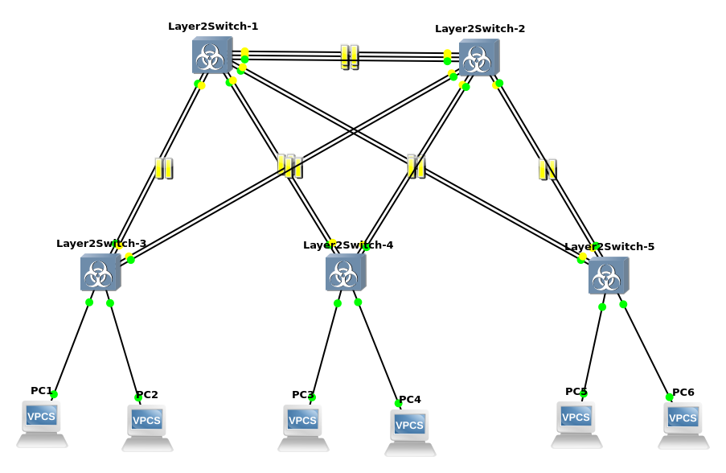

# Настройка агрегирования каналов

## Команды настройки
### switch 1
```
vIOS-L2>enable
vIOS-L2#config
vIOS-L2(config)#hostname switch1
switch1(config)#spanning-tree mode pvst
switch1(config)#spanning-tree vlan 1 root primary
switch1(config)#interface range gi0/0-3, gi1/0-3, gi2/0
switch1(config-if)#switchport trunk encaplusation dot1q
switch1(config-if)#switchport trunk allowed vlan 1
switch1(config-if)#switchport mode trunk
switch1(config-if)#exit
switch1(config)#interface range gi0/0-2
switch1(config-if)#channel-group 1 mode active
switch1(config-if)#exit
switch1(config)#interface range gi0/3, gi1/0
switch1(config-if)#channel-group 2 mode active
switch1(config-if)#exit
switch1(config)#interface range gi1/1-2
switch1(config-if)#channel-group 3 mode active
switch1(config-if)#exit
switch1(config)#interface range gi1/3, gi2/0
switch1(config-if)#channel-group 4 mode active
switch1(config-if)#end
switch1#wr
```

### switch 2
```
vIOS-L2>enable
vIOS-L2#config
vIOS-L2(config)#hostname switch2
switch2(config)#spanning-tree mode pvst
switch2(config)#spanning-tree vlan 1 root secondary
switch2(config)#interface range gi0/0-3, gi1/0-3, gi2/0
switch2(config-if)#switchport trunk encaplusation dot1q
switch2(config-if)#switchport trunk allowed vlan 1
switch2(config-if)#switchport mode trunk
switch2(config-if)#exit
switch2(config)#interface range gi0/0-2
switch2(config-if)#channel-group 1 mode active
switch2(config-if)#exit
switch2(config)#interface range gi0/3, gi1/0
switch2(config-if)#channel-group 2 mode active
switch2(config-if)#exit
switch2(config)#interface range gi1/1-2
switch2(config-if)#channel-group 3 mode active
switch2(config-if)#exit
switch2(config)#interface range gi1/3, gi2/0
switch2(config-if)#channel-group 4 mode active
switch2(config-if)#end
switch2#wr
```

### switch 3
```
vIOS-L2>enable
vIOS-L2#config
vIOS-L2(config)#hostname switch3
switch3(config)#spanning-tree mode pvst
switch3(config)#interface range gi0/0-3
switch3(config-if)#switchport trunk encaplusation dot1q
switch3(config-if)#switchport trunk allowed vlan 1
switch3(config-if)#switchport mode trunk
switch3(config-if)#exit
switch3(config)#interface range gi0/0-1
switch3(config-if)#channel-group 1 mode active
switch3(config-if)#exit
switch3(config)#interface range gi0/2-3
switch3(config-if)#channel-group 2 mode active
switch3(config-if)#exit
switch3(config)#interface range gi1/0-1
switch3(config-if)#spanning-tree portfast
switch3(config-if)#end
switch3#wr
```

### switch 4
```
vIOS-L2>enable
vIOS-L2#config
vIOS-L2(config)#hostname switch4
switch4(config)#spanning-tree mode pvst
switch4(config)#interface range gi0/0-3
switch4(config-if)#switchport trunk encaplusation dot1q
switch4(config-if)#switchport trunk allowed vlan 1
switch4(config-if)#switchport mode trunk
switch4(config-if)#exit
switch4(config)#interface range gi0/0-1
switch4(config-if)#channel-group 1 mode active
switch4(config-if)#exit
switch4(config)#interface range gi0/2-3
switch4(config-if)#channel-group 2 mode active
switch4(config-if)#exit
switch4(config)#interface range gi1/0-1
switch4(config-if)#spanning-tree portfast
switch4(config-if)#end
switch4#wr
```

### switch 5
```
vIOS-L2>enable
vIOS-L2#config
vIOS-L2(config)#hostname switch5
switch5(config)#spanning-tree mode pvst
switch5(config)#interface range gi0/0-3
switch5(config-if)#switchport trunk encaplusation dot1q
switch5(config-if)#switchport trunk allowed vlan 1
switch5(config-if)#switchport mode trunk
switch5(config-if)#exit
switch5(config)#interface range gi0/0-1
switch5(config-if)#channel-group 1 mode active
switch5(config-if)#exit
switch5(config)#interface range gi0/2-3
switch5(config-if)#channel-group 2 mode active
switch5(config-if)#exit
switch5(config)#interface range gi1/0-1
switch5(config-if)#spanning-tree portfast
switch5(config-if)#end
switch5#wr
```

### PC 1
```
PC1>ip 10.1.1.11/24
```

### PC 2
```
PC1>ip 10.1.1.12/24
```

### PC 3
```
PC1>ip 10.1.1.13/24
```

### PC 4
```
PC1>ip 10.1.1.14/24
```

### PC 5
```
PC1>ip 10.1.1.15/24
```

### PC 6
```
PC1>ip 10.1.1.16/24
```

## Работоспособность
Работоспособность режима конфигурации была проверена путем отключения некоторых линков. Между каждой парой коммутаторов было оставлено только одно соединение. С помощью команды ping была проверена связь между каждым конечным устройством и всеми другими конечными устройствами.


## Статистика
Статистика приведена в файле stats.xlsx до выполнения команды ping и после. Команда ping была выполнена на всех конечных устройствах для проверки связи с другими конечными устройствами.

## Решение проблемы EtherChannel и STP
В прошивке vIOS-L2, по-видимому, присутствует баг, связанный с каналами и STP. Если STP заблокирует EtherChannel, то на интерфейсах, входящих в этот EtherChannel, все еще будут изучаться MAC-адреса. Поэтому я добавил статические записи в коммутаторах 3, 4 и 5. В этих записях были привязаны MAC-адреса конечных устройств к портам, к которым они подключены.