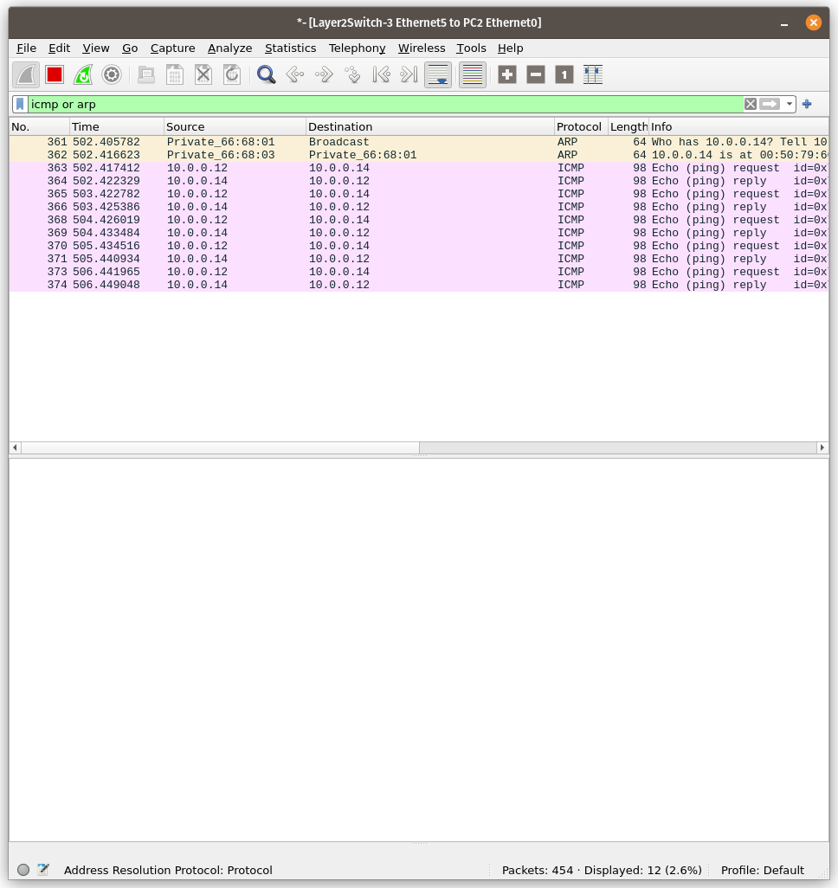

# Настройка виртуальной локальной сети (VLAN)

## Команды настройки

### Switch 1
```
vIOS-L2> enable
vIOS-L2# config terminal
vIOS-L2(config)# hostname switch1
switch1(config)# spanning-tree mode pvst
switch1(config)# spanning-tree vlan 333 root primary
switch1(config)# spanning-tree vlan 20 root secondary
switch1(config)# vlan 333
switch1(config-vlan)# name VLAN333
switch1(config-vlan)# exit
switch1(config)# vlan 20
switch1(config-vlan)# name VLAN20
switch1(config-vlan)# exit
switch1(config)# interface range Gi0/0-3,Gi1/0-3
switch1(config-if-range)# switchport trunk encapsulation dot1q
switch1(config-if-range)# switchport mode trunk
switch1(config-if-range)# switchport trunk native vlan 333
switch1(config-if-range)# switchport trunk allowed vlan 20,333
switch1(config-if-range)# end
switch1# wr
```

### Switch 2
```
vIOS-L2> enable
vIOS-L2# config terminal
vIOS-L2(config)# hostname switch2
switch2(config)# spanning-tree mode pvst
switch2(config)# spanning-tree vlan 20 root primary
switch2(config)# spanning-tree vlan 333 root secondary
switch2(config)# vlan 333
switch2(config-vlan)# name VLAN333
switch2(config-vlan)# exit
switch2(config)# vlan 20
switch2(config-vlan)# name VLAN20
switch2(config-vlan)# exit
switch2(config)# interface range Gi0/0-3,Gi1/0-3
switch2(config-if-range)# switchport trunk encapsulation dot1q
switch2(config-if-range)# switchport mode trunk
switch2(config-if-range)# switchport trunk native vlan 333
switch2(config-if-range)# switchport trunk allowed vlan 20,333
switch2(config-if-range)# end
switch2# wr
```

### Switch 3
```
vIOS-L2> enable
vIOS-L2# config terminal
vIOS-L2(config)# hostname switch3
switch3(config)# spanning-tree mode pvst
switch3(config)# vlan 333
switch3(config-vlan)# name VLAN333
switch3(config-vlan)# exit
switch3(config)# vlan 20
switch3(config-vlan)# name VLAN20
switch3(config-vlan)# exit
switch3(config)# interface range Gi0/0-3
switch3(config-if-range)# switchport trunk encapsulation dot1q
switch3(config-if-range)# switchport mode trunk
switch3(config-if-range)# switchport trunk native vlan 333
switch3(config-if-range)# switchport trunk allowed vlan 20,333
switch3(config-if-range)# exit
switch3(config)# interface Gi1/0
switch3(config-if)# switchport mode access
switch3(config-if)# switchport access vlan 20
switch3(config-if)# spanning-tree portfast
switch3(config-if)# exit
switch3(config)# interface Gi1/1
switch3(config-if)# switchport mode access
switch3(config-if)# switchport access vlan 333
switch3(config-if)# spanning-tree portfast
switch3(config-if)# end
switch3# wr
```

### Switch 4
```
vIOS-L2> enable
vIOS-L2# config terminal
vIOS-L2(config)# hostname switch4
switch4(config)# spanning-tree mode pvst
switch4(config)# vlan 333
switch4(config-vlan)# name VLAN333
switch4(config-vlan)# exit
switch4(config)# vlan 20
switch4(config-vlan)# name VLAN20
switch4(config-vlan)# exit
switch4(config)# interface range Gi0/0-3
switch4(config-if-range)# switchport trunk encapsulation dot1q
switch4(config-if-range)# switchport mode trunk
switch4(config-if-range)# switchport trunk native vlan 333
switch4(config-if-range)# switchport trunk allowed vlan 20,333
switch4(config-if-range)# exit
switch4(config)# interface Gi1/0
switch4(config-if)# switchport mode access
switch4(config-if)# switchport access vlan 20
switch4(config-if)# spanning-tree portfast
switch4(config-if)# exit
switch4(config)# interface Gi1/1
switch4(config-if)# switchport mode access
switch4(config-if)# switchport access vlan 333
switch4(config-if)# spanning-tree portfast
switch4(config-if)# end
switch4# wr
```

### Switch 5
```
vIOS-L2> enable
vIOS-L2# config terminal
vIOS-L2(config)# hostname switch5
switch5(config)# spanning-tree mode pvst
switch5(config)# vlan 333
switch5(config-vlan)# name VLAN333
switch5(config-vlan)# exit
switch5(config)# vlan 20
switch5(config-vlan)# name VLAN20
switch5(config-vlan)# exit
switch5(config)# interface range Gi0/0-3
switch5(config-if-range)# switchport trunk encapsulation dot1q
switch5(config-if-range)# switchport mode trunk
switch5(config-if-range)# switchport trunk native vlan 333
switch5(config-if-range)# switchport trunk allowed vlan 20,333
switch5(config-if-range)# exit
switch5(config)# interface Gi1/0
switch5(config-if)# switchport mode access
switch5(config-if)# switchport access vlan 20
switch5(config-if)# spanning-tree portfast
switch5(config-if)# exit
switch5(config)# interface Gi1/1
switch5(config-if)# switchport mode access
switch5(config-if)# switchport access vlan 333
switch5(config-if)# spanning-tree portfast
switch5(config-if)# end
switch5# wr
```

## Доступность компьютеров


## Перехват трафика
### PC 1
```
ping 10.0.0.13
```

__PC1 <-> Switch3__


__Switch3 <-> Switch2__


### PC 2
```
ping 10.0.0.14
```

__PC2 <-> Switch3__


__Switch3 <-> Switch2__
